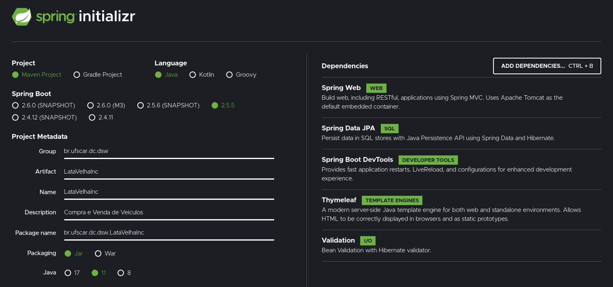

# LataVelhaInc. (Site de compra e venda de veiculos usando Spring/Thymeleaf)


### Dependências ###
- mysql
- java 11 https://www.oracle.com/java/technologies/downloads/#java11

### Antes de executar ###
Acesse o arquivo application.properties localizado em:
```
LataVelhaInc/src/main/resources/application.properties
```
e nas linhas 3 e 4, coloque seu usuário e senha do MYSQL, respectivamente.

### Para executar ###
1. Clone ou baixe o repositório https://github.com/VLx2000/LataVelhaInc-Spring-Thymeleaf.git
2. Acesse a pasta **LataVelhaInc/**
3. Execute ```mvn spring-boot:run```
4. Em um navegador acesse http://localhost:8080/
5. E, por fim, compre seu Corsa turbinado ou Uno com escada!


### Configuração Spring ###



#### Envio de email ####


### Integrantes ###

- Lucas Vinícius Domingues 769699
- Rafael Yoshio Yamawaki Murata 769681
- Victor Luís Aguilar Antunes 769734

Arquivo com a separação dos requisitos:
[Checklist](checklist.md)

Documento de requisitos:
[Requisitos](Requisitos-A2.pdf)
